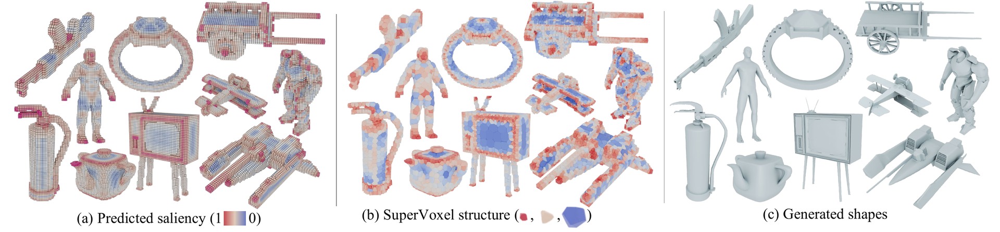

# SuperVoxelGPT

**Adaptive and Ordered 3D Tokenization for Autoregressive Shape Generation**

Yuan Li, Congyi Zhang, Xifeng Gao, Xiaohu Guo — ECCV 2026



- [Project page](https://lidan233.github.io/supervoxelgpt/)
- [Paper](https://arxiv.org/abs/2605.29655)
- [Video](https://youtu.be/umE-4IIj1II)

## What this is

The shape itself decides where the tokens go: fine cells where the geometry is
detailed, coarse cells where it is smooth. Sequence length drops to 12.8% of
uniform voxel tokenization while matching state-of-the-art quality at full 1024³.

**Why the shorter sequence matters.** It is not a compression statistic — it is
what makes everything downstream cheaper. A shorter sequence means a smaller
model, a shorter training run, and less hardware to train it on: the whole
pipeline finishes within 7 days on 8×H200 or 8×A800, because quadratic attention
over an eighth of the tokens is a different training problem. The same saving
shows up at generation time — a caption becomes a 1024³ mesh in about 3.4 seconds
on a single RTX 4090.

**Where we think this is going.** 3D generation looks likely to split into two
camps. One is agent-driven: the strongest spatial-reasoning models, several turns
of dialogue, producing compact editable primitives — powerful, but slow. The
other is single-pass diffusion and autoregressive models: very fast, but what
comes out is not editable. This work hopes to be a step toward making the second camp
faster still with 1024 resolution.

## Release status

- [x] **(a) Geometry and saliency** — converting a non-watertight shape into a
      sharp watertight mesh, and computing its spectral mesh saliency.
      See [`data/data_prep/`](data/data_prep/).
- [x] **(b1) CVT** — the annealed tessellation that places the supervoxel
      centers, shared by the corpus step and inference. See
      [`train/vendor/runtime/pycvt/`](train/vendor/runtime/pycvt/).
- [x] **(b2) Datasets** — the corpus is split 19,000 training / 1,000 test
      shapes, disjoint, and both caption sets are in
      [`data/data_prep/3_train_test_data/`](data/data_prep/3_train_test_data/),
      nine lengths each.
- [x] **(c) Training and inference** — [`train/`](train/) holds both stages'
      models, their two autoencoders, the datasets that feed them, and six entry
      points: an autoencoder and a text- and image-conditioned generator per
      stage. [`inference/text2shape.py`](inference/text2shape.py) is the other
      direction in one file — caption to mesh, every stage in the order they run
      — and [`vis/`](vis/) renders what comes out.
- [x] **(d) text2shape checkpoint, 20k shapes** — the released weights, trained on
      the 19,000-shape training split of a 20,000-shape corpus.
      `bash ckpts/fetch_ckpts.sh` downloads and verifies them; see
      [`ckpts/README.md`](ckpts/README.md).
- [ ] **(e) Multi-scale winding number for watertighting** — the current sealing
      step is a narrow-band field plus floodfill, which is what the released
      numbers were produced with. A multi-scale generalized winding number is the
      more robust construction on inputs whose parts are separated or
      inconsistently oriented. That code exists and is being cleaned up for
      release.
- [ ] **(f) Scaling up** — the released model is trained on 19,000 shapes with a
      10,125-entry codebook and a 0.5B generator. The next step scales all three:
      100k shapes, a larger codebook, and a model past 0.5B, together with more
      robustness to noisy input. The tokenizer is what makes a corpus that size
      affordable, so this is a scale-up rather than a redesign. Planned for the
      next allocation on the LightSpeed / UTD clusters.

## Environment

[`env/environment.yml`](env/environment.yml) records the environment the reported
numbers were produced in. Reference platform: python 3.10 · torch 2.6.0+cu124 ·
CUDA 12.4 · sm_80/86/89.

`conda env create -f environment.yml` gets most of the way but not all of it, and
that is a property of the dependency set rather than a defect in the file: `torch`
and the PyG extensions are local-version wheels that live outside PyPI,
`flash-attn` imports torch inside its own `setup.py`, and three packages are
installed from git. Those five are pinned in a comment block at the end of the
file; [`env/README.md`](env/README.md) gives the install order that works.

Three CUDA extensions are built or installed separately — `flex_gemm`, `o_voxel`
and `cumesh` — and the CVT kernel ships prebuilt in `train/vendor/runtime/pycvt/`.
If you only want geometry and saliency preparation, `env/README.md` lists the much
smaller subset those scripts need.

## Evaluation

### 1. Fetch the checkpoints

```bash
bash ckpts/fetch_ckpts.sh        # verified against MD5SUMS.txt
```

See [`ckpts/README.md`](ckpts/README.md) for what each file is and which stage
loads it.

### 2. Ten objects, timed and rendered

[`inference/eval_fast.py`](inference/eval_fast.py) generates ten held-out objects,
times each one, and writes a contact sheet with the time beside every row.

```bash
python inference/eval_fast.py            # -> assets/teaser_sheet.png
```

The sheet lands in `assets/teaser_sheet.png`, one row per object with its
generation time beside it, and the per-object numbers in
`assets/teaser/timings.json`. One RTX 4090, model loading excluded. The captions
are in [`inference/fast_captions.json`](inference/fast_captions.json), drawn from
the held-out test set.

### 3. The whole test set

[`inference/eval_all.py`](inference/eval_all.py) runs one generation for each of the
1,000 final-test objects, on a caption length drawn per object under `--seed` so a run
spans all nine (`--tier N` pins one instead). The 100-object validation set used for
checkpoint selection comes from the training split.
Meshes are discarded as they are measured, so the run needs no disk beyond its log.
The script also contains a disabled symmetric Chamfer Distance reference block. Enabling it
requires downloading the corpus and running geometry preparation first. Before surface sampling,
generated and reference meshes are each normalized into `[0, 1]³` using their bounding-box center
and longest side while preserving aspect ratio; rotation and axis conventions are not altered.

```bash
python inference/eval_all.py             # -> assets/eval_all.jsonl
python inference/eval_all.py --limit 100 # a shorter pass
```

The test set is
[`test1000_captions.json`](data/data_prep/3_train_test_data/test1000_captions.json):
1,000 objects disjoint from the original 19,000-object training split, with nine
caption lengths each. The first 100 training records are reserved for validation;
the remaining 18,900 are used for optimization.

## Training

Run every command in this section from the repository root. The repository is not
installed as a `supervoxelfinal` Python package; its executable modules therefore use
the root package name `train`:

```bash
cd /path/to/supervoxelfinal
```

### 1. Prepare the data

[`data/data_prep/README.md`](data/data_prep/README.md) documents the pipeline —
geometry, saliency, and the four encoders. Try it on the bundled asset first:

```bash
bash example/run_all.sh            # all nine stages, into example/work/
```

For the full corpus, run the same chain over every id in
[`train19000_captions.json`](data/data_prep/3_train_test_data/train19000_captions.json)
and [`test1000_captions.json`](data/data_prep/3_train_test_data/test1000_captions.json).
`c_global_stats.py` fits percentiles on the training split only; pass
`--train-split data/data_prep/3_train_test_data/train19000_captions.json`.  The
resulting fixed statistics are then used unchanged for validation and test objects.

### 2. Train the two autoencoders

They define the vocabulary everything else is written in, so they come first: the
saliency VAE's codebook is what stage 1 predicts, and the supervoxel VAE's is what
stage 2 predicts. Retraining either one invalidates the generators trained against
it. Both take a JSON config for model and schedule settings. Corpus locations are
explicit command-line arguments, so a copied config cannot silently train on an
example or on the wrong directory:

```bash
python -m train.stage1Text2Saliency.train_vae \
    --config ckpts/stage1SaliencyVaeConfig.json \
    --data-dir /path/to/train/saliency_fields

python -m train.stage2TextSaliency2Shape.train_vae \
    --config ckpts/stage2SupervoxelVaeConfig.json \
    --dataset-root /path/to/train/vxz \
    --cvt-root /path/to/train/cvt
```

### 3. Train the two generators

With the vocabularies fixed, each stage trains on either text or rendered views —
four entry points, same model, differing only in which dataset they build:

Formal runs reserve the first 100 records of `train19000_captions.json` for validation
and optimize on the remaining 18,900; `eval_loss` chooses the best checkpoint, which is
restored at the end. All 1,000 records in `test1000_captions.json` remain final test data.
The exact IDs are recorded in `validation_test_split.json` under the run directory.

```bash
python -m train.stage1Text2Saliency.train_text \
    --code-dir example/work/saliency_code --condition-dir example/work/cond_text \
    --train-split example/captions.json --test-split example/test_split.json \
    --validation-size 0 \
    --repeat-factor 8 --max-steps 2 --micro-batch-size 2 --save-path runs/s1t

python -m train.stage2TextSaliency2Shape.train_text \
    --token-dir example/work/tokens --condition-dir example/work/cond_text \
    --train-split example/captions.json --test-split example/test_split.json \
    --validation-size 0 \
    --repeat-factor 8 --max-steps 2 --micro-batch-size 2 --save-path runs/s2t
```

`--test-split` is passed explicitly because it otherwise defaults to the corpus test
file, and the entry points refuse a run whose training and test ids overlap.
[`example/test_split.json`](example/test_split.json) is empty: the bundled corpus is one
object, and it is training data.

The image branches take `--condition-dir example/work/cond_image` and
`--global-mean example/work/global_mean.npy` instead. For a formal corpus run,
`global_mean.npy` is computed from train-split image features and then frozen;
validation and test features use the same mean. The bundled
single-object mean is only a smoke-test fixture.

On the single-object corpus above they report the repetition applied, so such a run
is never mistaken for a corpus one:

```
[text2saliency]   1 objects with both code and captions x 8 = 8
[textcvt2shape]   1 objects with both tokens and captions x 8 = 8
```

## Acknowledgements

This work builds on code released by others:

- **[TRELLIS](https://github.com/microsoft/TRELLIS)** and
  **[TRELLIS.2](https://github.com/microsoft/TRELLIS.2)** (Microsoft, MIT) — the
  sparse-tensor framework the supervoxel autoencoder is built on, and `o_voxel`
  for dual-grid extraction.
- **[FlexGEMM](https://github.com/JeffreyXiang/FlexGEMM)** and
  **[CuMesh](https://github.com/JeffreyXiang/CuMesh)** (Jianfeng Xiang, MIT) — the
  sparse convolutions the autoencoder cannot be constructed without, and the mesh
  cleanup after extraction.
- **[FlexiCubes](https://github.com/nv-tlabs/FlexiCubes)** (NVIDIA) — the
  differentiable isosurface extraction used in the sharpening step.
- **[cubvh](https://github.com/ashawkey/cubvh)** (Jiaxiang Tang) — the CUDA BVH
  behind the unsigned-distance queries.
- **[Pointcept](https://github.com/Pointcept/Pointcept)** — `pointops`, for the
  KNN grouping in the cross-attention layers.
- **[BlenderToolbox](https://github.com/HTDerekLiu/BlenderToolbox)** (Derek Liu) —
  the renders in the paper and on the project page.

## License

MIT, in [`LICENSE`](LICENSE). The vendored and prebuilt third-party components
keep their own licenses — [`NOTICE`](NOTICE) names each one and where it is used.

## Citation

```bibtex
@inproceedings{li2026supervoxelgpt,
  title     = {Adaptive and Ordered 3D Tokenization for Autoregressive Shape Generation},
  author    = {Li, Yuan and Zhang, Congyi and Gao, Xifeng and Guo, Xiaohu},
  booktitle = {European Conference on Computer Vision (ECCV)},
  year      = {2026}
}
```
