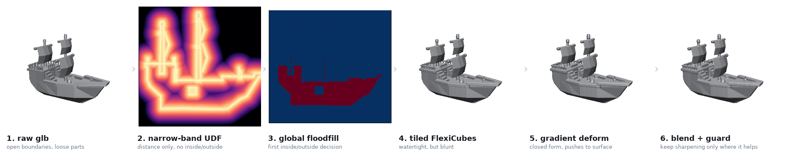
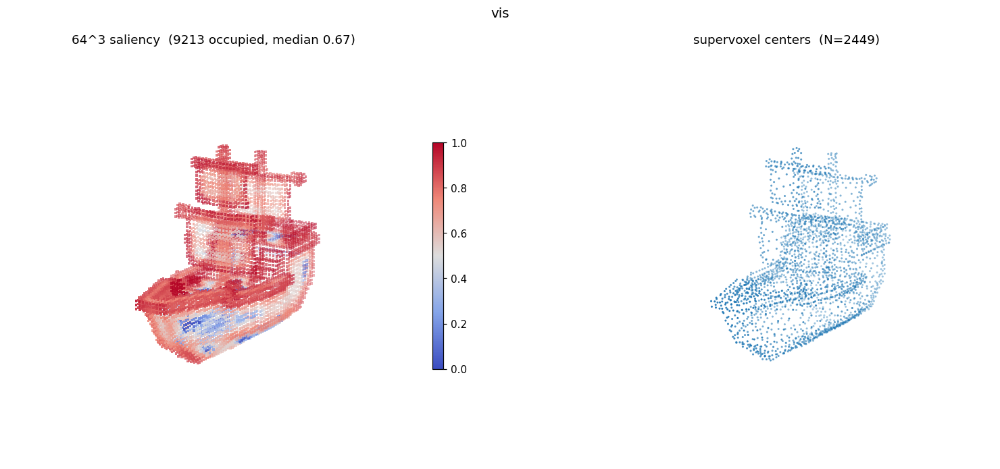
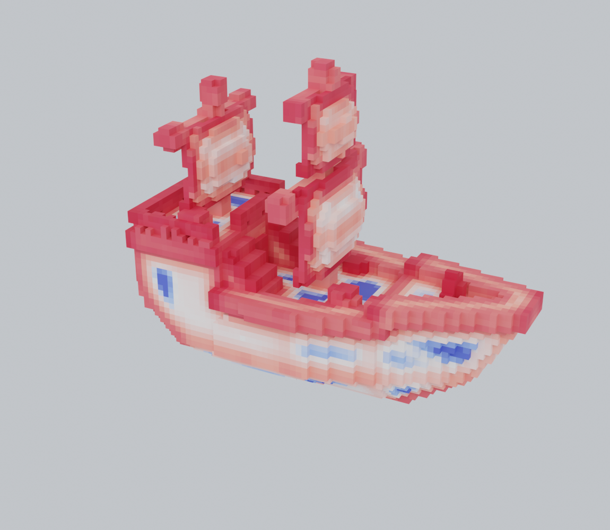

# Data preparation

Raw glb in, model datasets out. Three numbered folders, run in order — the number is the stage, and
within a folder the leading letter of each script is its position in that stage.

```
1_geometry  ──►  2_saliency  ──►  3_train_test_data
sharp watertight     N supervoxel          tokens, codes
mesh + occupancy     centers               and conditioning
```

`example/run_all.sh` runs all three on the one asset bundled with this repository.

---

## `1_geometry/` — conditioning the mesh

Raw assets have open boundaries, self-intersections and loose parts. Two properties of such meshes
destroy the feature redundancy the supervoxel codebook depends on, so two things have to happen
before anything else: the surface must be **sealed**, and then **sharpened back**, because sealing
an isosurface leaves it blunt.



The first three panels seal the mesh: distance alone is defined on any mesh however broken, a global
floodfill turns that distance field into an inside/outside decision, and FlexiCubes extracts a
closed surface from it. The last three put the sharpness back: a closed-form deformation pushes grid
points onto the surface, and a per-vertex blend keeps that refinement only where it actually
improved the fit, with a roughness guard behind it. Production runs at 1024³.

| file | what it does |
|---|---|
| `run.sh` | the stage entry point — runs everything below in order |
| `step1_watertight/a_tile_extract.py` | narrow-band UDF → global floodfill → tiled FlexiCubes; emits the sealed mesh |
| `step1_watertight/FlexiCubes/` | the extraction kernel and its lookup tables |
| `step1_watertight/cubvh_patch/` | an int32→size_t patch for cubvh's floodfill, needed only above 512³ |
| `step1_watertight/winding_number_branch/` | an alternative way to decide inside/outside, accurate but far slower; not used for the released data |
| `step2_sharpen/a_deform_refine_sparc.py` | analytic gradient deformation, then optional multi-view refinement |
| `step2_sharpen/b_blend_keepbest.py` | per-vertex: keep the refined position only where it fits the reference normals better |
| `step2_sharpen/c_final_guard.py` | roughness backstop — the delivered mesh is never rougher than the plain sealed one |
| `step2_sharpen/d_lap_vxz.py` | Laplacian smoothing, then voxelization to `.vxz` |

Sealing decides topology **before** any tiling happens, which is why the tile seams close exactly.
The sharpening steps are allowed to fail: the blend and the guard each reject work that did not
help, so the worst case is "no improvement" rather than a damaged mesh.

---

## `2_saliency/` — deciding where the budget goes

The adaptive budget is decided here. A saliency field says where the geometry is detailed, and a
tessellation turns that field into a concrete set of centers whose density follows it.



Left, the saliency field sampled onto the occupancy grid; right, the supervoxel centers derived from
it. The two agree about where the detail is — dense centers along masts, railings and hull chines,
sparse across smooth panels. That agreement is the whole point, and it is the first thing to check
when a shape comes out wrong.



The same field rendered as voxels: warm where the surface carries detail, cool in the flat interior
wells. Saliency is intrinsic to the mesh, not a screen-space measure — it does not depend on a
viewpoint.

| file | what it does |
|---|---|
| `a_spectral_saliency.py` | curvature-seeded heat diffusion on the cotangent Laplacian, difference-of-Gaussians across scales |
| `b_sample_to_64.py` | samples the per-vertex field onto the object's own occupancy grid, max-pooled to 64³ |
| `c_global_stats.py` | percentile cut points fitted on the training split, then frozen for validation and test |
| `d_cvt_pycvt.py` | budget `N = Σ 1/f³`, then the annealed CVT places those N centers |

Two choices here are load-bearing. The field is sampled onto the **occupancy grid itself** rather
than a second voxelization, so the two agree cell for cell by construction. And the normalization is
**training-corpus-wide, never per shape or on test data** — normalizing per shape maps every object's most salient region to
the top of the range, which erases the very difference between a plain bowl and a filigree lattice.

`d_cvt_pycvt.py` calls the same function `inference/text2shape.py` calls, so the centers a corpus
records and the centers serving computes come from one implementation.

---

## `3_train_test_data/` — captions and encoders

What the models actually read: the caption text, and four encoders that turn one prepared object
into tensors. The corpus is split 19,000 training / 1,000 test shapes, disjoint; the two released
autoencoder configs in `ckpts/` record that split in their `dataset` section.

| file | what it does |
|---|---|
| `train19000_captions.json` | captions for the 19,000 training shapes, nine lengths each |
| `test1000_captions.json` | the same for the 1,000 test shapes |
| `encode_saliency_codes.py` | 64³ field → the saliency VAE's discrete codes |
| `encode_tokens.py` | voxelization + centers → one shape token per center |
| `encode_text_condition.py` | captions → CLIP features |
| `encode_image_condition.py` | rendered views → DINOv2 patch features |

Each caption record is one id plus `tier_0` … `tier_8`, the same description written at nine
decreasing lengths — full sentence down to a handful of words. Training on all nine is what lets the
model accept a three-word prompt as readily as a paragraph.

The split lists, the packed archives, and the released renders and features are not published yet.
